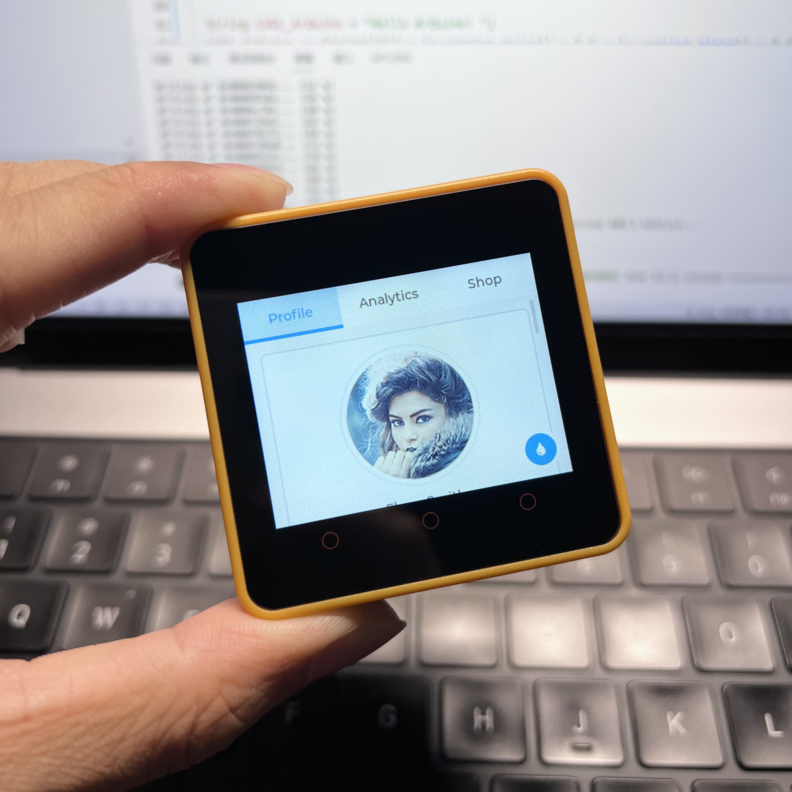

# M5Core2 LVGL Template

This is an LVGL template project for M5Stack Core 2 devices, only the necessary lib files are installed and all options are already configured.

Clone this project directly and use the PlatformIO IDE to open it and run the example program directly.

The version of the lib used in this project:

1. AXP192(0.1.7 from [M5Core2](https://github.com/m5stack/M5Core2) lib)
2. [TFT_eSPI](https://github.com/Bodmer/TFT_eSPI)(2.5.0)
3. [LVGL](https://github.com/lvgl/lvgl)(8.3.10)

## 中文介绍

这是一个适用于 M5Stack Core 2 设备的 LVGL 模版工程，仅安装必要的 lib 文件，已经配置好所有的选项。

直接克隆本项目，使用 PlatformIO IDE 打开后可直接运行事例程序。

本项目所使用到的 lib 版本：

1. AXP192(0.1.7 from [M5Core2](https://github.com/m5stack/M5Core2) lib)
2. [TFT_eSPI](https://github.com/Bodmer/TFT_eSPI)(2.5.0)
3. [LVGL](https://github.com/lvgl/lvgl)(8.3.10)
